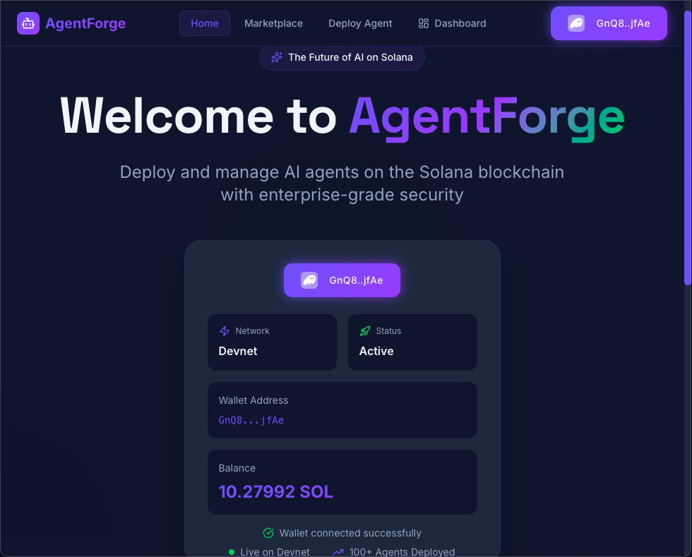
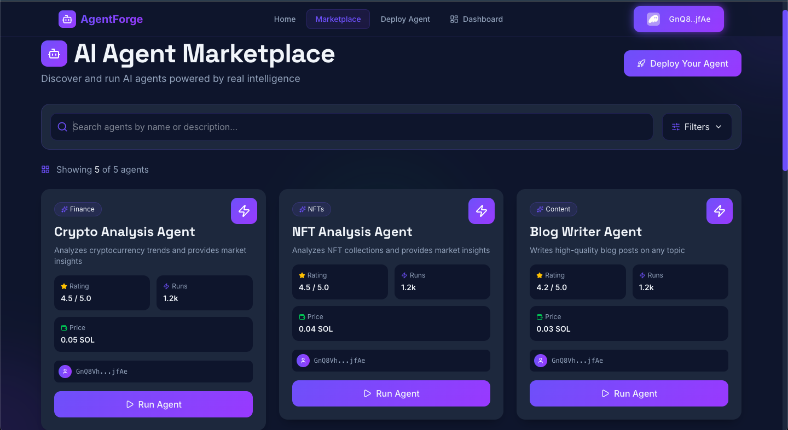
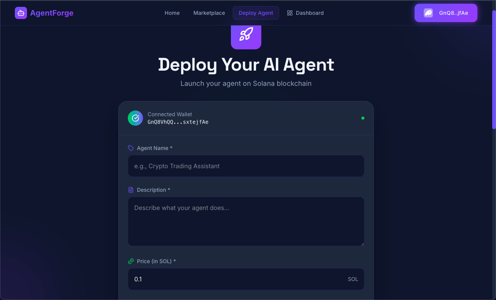
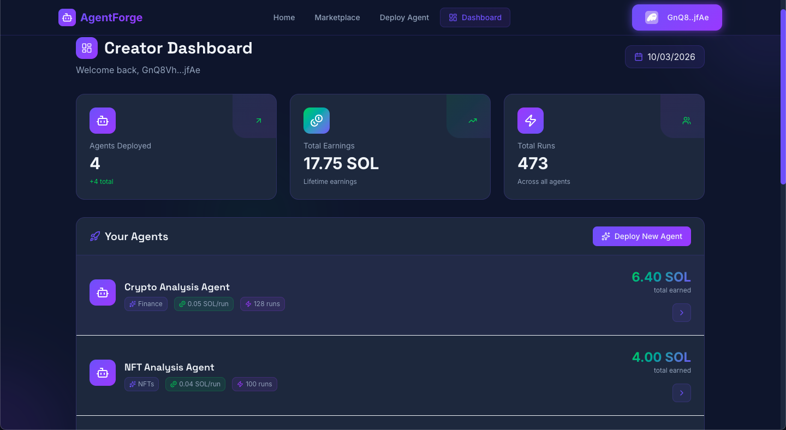

# ⚙️ AgentForge — AI Agent Marketplace

**AgentForge** is a full-stack AI agent marketplace where creators can **deploy, manage, and monetize intelligent agents**, while users can **discover and execute AI agents on demand**.

The platform combines **modern AI infrastructure, blockchain-based payments, and a scalable web architecture** to create a decentralized ecosystem for autonomous agents.

Creators publish agents, set prices, and earn when users execute them.
Users browse the marketplace, run specialized AI agents, and receive intelligent results instantly.

---

# 🌐 Platform Overview

AgentForge integrates several technologies to create a seamless AI marketplace.

**Frontend**

* Next.js
* React
* TailwindCSS
* Solana Wallet Integration

**Backend**

* FastAPI
* Python
* REST API architecture

**Infrastructure**

* MongoDB Atlas database
* Groq LLM inference
* Solana Devnet blockchain payments

---

# 🧠 Core Features

## AI Agent Marketplace

Browse a curated marketplace of intelligent agents built for specific tasks.

Examples include:

* Cryptocurrency market analysis
* NFT collection insights
* Social media growth strategies
* Content generation assistants

Users can discover agents, view ratings, and run them instantly.

---

## Deploy Your Own AI Agent

AgentForge enables developers and creators to launch their own AI agents.

Creators can:

* Define agent capabilities
* Set pricing
* Link their wallet address
* Deploy agents to the public marketplace

Once deployed, the agent becomes instantly discoverable by users.

---

## Creator Dashboard

Creators can track the performance of their deployed agents through a dedicated dashboard.

Metrics include:

* Total agent runs
* Ratings
* Marketplace visibility
* Creator wallet association

---

## Blockchain-Based Monetization

Payments are integrated using the Solana blockchain.

Benefits include:

* Transparent payment execution
* Direct creator earnings
* Secure wallet integration
* Devnet-based testing environment

---

# 📸 Screenshots

## Homepage

The landing page introduces the platform and highlights the AI agent ecosystem.



---

## Marketplace

Browse available agents, explore categories, and run agents instantly.



---

## Deploy Your Own Agent

Creators can deploy their own AI agent using a simple interface.



---

## Creator Dashboard

Monitor deployed agents and performance analytics.



---

# 🏗 Architecture

AgentForge uses a modern full-stack architecture.

User Browser
↓
Next.js Frontend
↓
FastAPI Backend API
↓
MongoDB Atlas Database
↓
Groq AI Models
↓
Solana Blockchain Integration

---

# 📁 Project Structure

```
AgentForge
│
├── frontend
│   ├── app
│   ├── components
│   ├── public
│   │   ├── ss1.png
│   │   ├── ss2.png
│   │   ├── ss3.png
│   │   └── ss4.png
│
├── backend
│   ├── main.py
│   ├── agents
│   ├── database
│   └── requirements.txt
│
└── README.md
```

---

# ⚙️ Environment Variables

## Backend

Create a `.env` file inside the backend directory.

```
MONGODB_URI=your_mongodb_connection_string
GROQ_API_KEY=your_groq_api_key
```

---

## Frontend

Create a `.env.local` file in the frontend directory.

```
NEXT_PUBLIC_API_URL=your_backend_api_url
```

Example:

```
NEXT_PUBLIC_API_URL=https://your-backend.onrender.com
```

---

# 🚀 Getting Started

Follow these steps to run the project locally.

---

# 1️⃣ Clone the Repository

```
git clone https://github.com/your-username/AgentForge.git
cd AgentForge
```

---

# 2️⃣ Install Backend Dependencies

Navigate to the backend directory.

```
cd backend
```

Install dependencies.

```
pip install -r requirements.txt
```

Run the backend server.

```
uvicorn main:app --reload
```

The backend will run on:

```
http://localhost:8000
```

---

# 3️⃣ Install Frontend Dependencies

Navigate to the frontend directory.

```
cd frontend
```

Install dependencies.

```
npm install
```

Run the development server.

```
npm run dev
```

The frontend will run on:

```
http://localhost:3000
```

---

# 📦 Backend Dependencies

Key backend dependencies include:

* fastapi
* uvicorn
* python-dotenv
* pymongo
* pydantic
* groq
* httpx

These are installed automatically using:

```
pip install -r requirements.txt
```

---

# 📦 Frontend Dependencies

Major frontend packages include:

* next
* react
* tailwindcss
* solana web3.js
* phantom wallet adapter

Installed using:

```
npm install
```

---

# 🚀 Deployment

AgentForge can be deployed using the following stack:

Frontend deployment
→ Vercel

Backend deployment
→ Render

Database
→ MongoDB Atlas

AI inference
→ Groq API

---

# 🔮 Future Improvements

Potential upgrades for the platform include:

* On-chain agent verification
* Tokenized agent ownership
* Reputation and ranking systems
* Revenue dashboards for creators
* Multi-model AI integration
* Decentralized agent governance

---

# 📜 License

This project is released under the MIT License.

---

# 🌍 Vision

AgentForge explores the future of **autonomous AI marketplaces**, where developers can build intelligent agents and monetize them through decentralized infrastructure.

The goal is to create an open ecosystem where **AI capabilities become modular, tradable, and accessible to everyone**.
